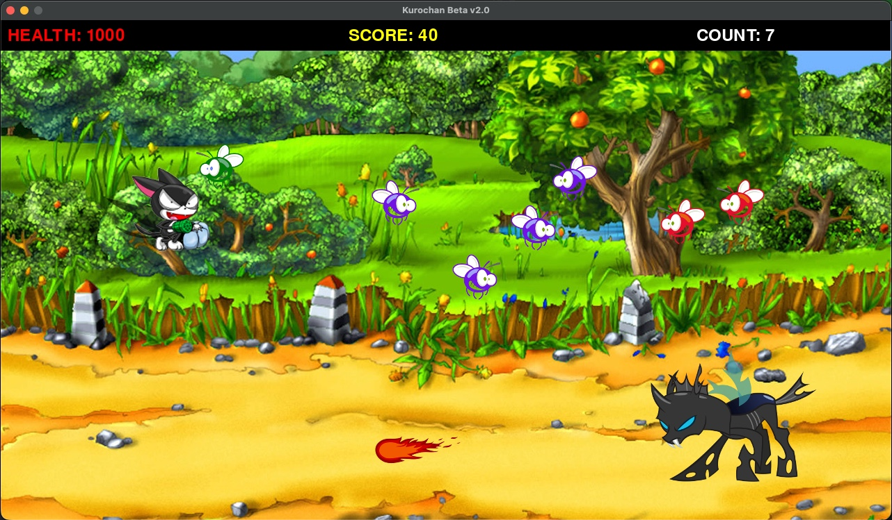
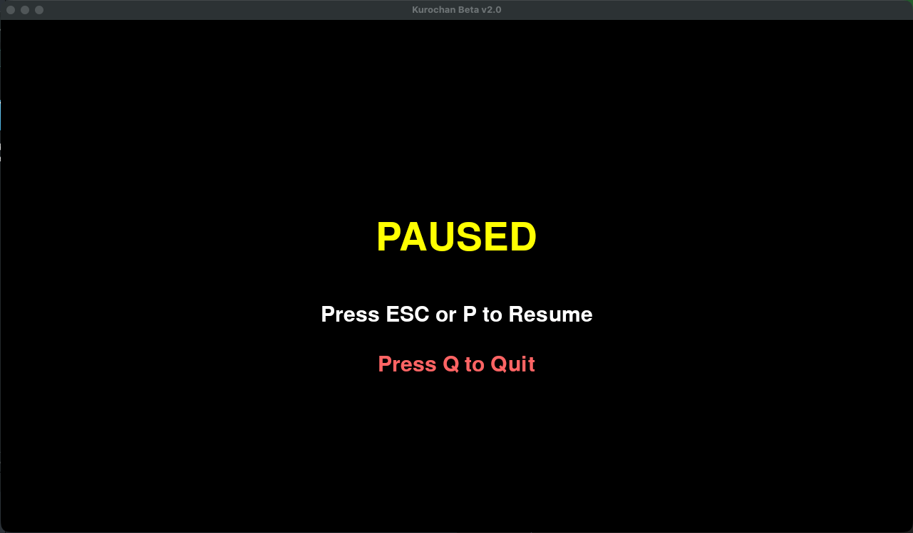
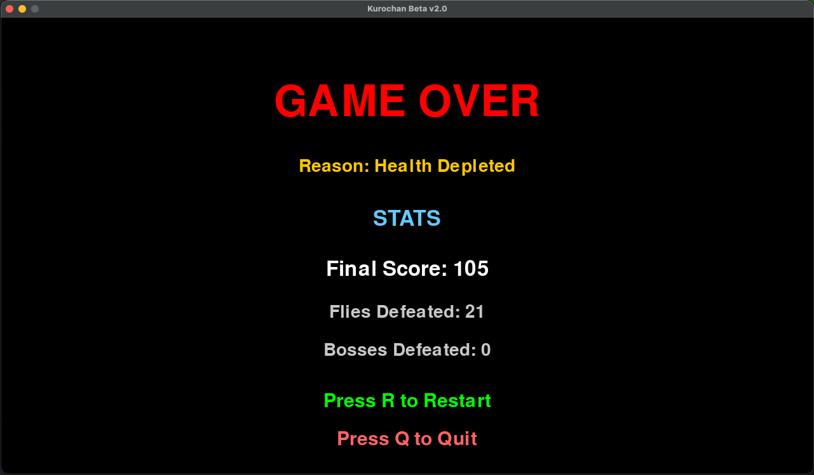

# Kurochan Beta v2.0

A classic 2D side-scrolling shooter game built with Python and Pygame. Control Kurochan, a heroic character on a quest to defeat waves of flies and an ultimate boss in an epic forest battle.


## Demo


---

## Table of Contents

- [Overview](#overview)
- [Features](#features)
- [Screenshots](#screenshots)
- [Gameplay](#gameplay)
- [Installation](#installation)
- [How to Play](#how-to-play)
- [Game Mechanics](#game-mechanics)
- [Project Structure](#project-structure)
- [Technical Details](#technical-details)
- [Upgrades Applied](#upgrades-applied)

---

## Overview

**PROJECT F.I.R.E - Kurochan Beta v2.0** is a retro-style arcade shooter game where you control Kurochan, defending the forest from an invasion of aggressive flies and a powerful boss named Petra. The game features smooth sprite-based animations, sound effects, background music, and progressively challenging enemy waves.

### Game Objective

- Survive waves of attacking flies
- Prevent the fly population from exceeding 20 simultaneously
- Defeat the boss that appears after 25 seconds
- Maximize your survival time and score

---

## Features

### Core Gameplay

- **Side-scrolling action** with smooth character movement
- **Shooting mechanics** with directional beam attacks
- **Jump mechanics** for dodging enemy attacks
- **Enemy AI** with sinusoidal flight patterns
- **Boss battle** with unique attack patterns
- **Collision detection** for combat interactions
- **Health system** for the player character

### Audio & Visual

- **Background music** with adjustable volume
- **Sound effects** for weapons and enemy attacks
- **Multiple enemy sprites** with varied appearances
- **Animated beam attacks** in both directions
- **Forest-themed background** artwork
- **24 FPS** gameplay for classic arcade feel

### Technical Features

- Sprite group management using Pygame
- Object-oriented design with inheritance
- Real-time collision detection
- Dynamic enemy spawning system
- Screen boundary enforcement
- Smooth animation frame handling

---

## Screenshots

Below are some gameplay screenshots showcasing Kurochan in action:

### Main Gameplay


### Pause Screen


### Game Over Screen


<!-- Add more screenshots as needed -->

---

## Gameplay

### The Story

In a peaceful forest, Kurochan must defend against an invasion of hostile flies. Armed with powerful beam weapons, Kurochan faces waves of enemies with unpredictable flight patterns. After 25 seconds of battle, the ultimate challenge arrives: Petra, the boss who commands devastating beam attacks.

### Win Condition

Defeat the boss while keeping the fly count under control.

### Lose Conditions

- Your health drops to 0
- 20 or more flies exist on screen simultaneously

---

## Installation

### Prerequisites

- Python 3.x (tested on Python 3.12.3)
- pip (Python package manager)

### Setup Instructions

1. **Clone the repository**

   ```bash
   git clone <repository-url>
   cd kurochan
   ```

2. **Install dependencies**

   ```bash
   pip install -r requirements.txt
   ```

   Or install pygame directly:

   ```bash
   pip install pygame
   ```

3. **Verify installation**
   ```bash
   python3 -c "import pygame; print('Pygame version:', pygame.__version__)"
   ```

---

## How to Play

### Starting the Game

```bash
python3 Main.py
```

### Controls

| Key               | Action              |
| ----------------- | ------------------- |
| **← Left Arrow**  | Move Kurochan left  |
| **→ Right Arrow** | Move Kurochan right |
| **↑ Up Arrow**    | Jump                |
| **Space**         | Fire beam weapon    |
| **Close Window**  | Exit game           |

### Game Screen

- **Top Right**: Fly count (keep below 20!)
- **Center**: Main game area
- **Bottom**: Kurochan's position

---

## Game Mechanics

### Player Character (Kurochan)

- **Starting Health**: 1000 HP
- **Movement Speed**: 5 pixels per frame
- **Jump Height**: 150 pixels maximum
- **Weapon**: Directional beam (changes based on facing direction)
- **Beam Damage**: 30 HP per hit

### Enemies

#### Flies

- **Spawn Rate**: Every 2 seconds (48 frames at 24 FPS)
- **Health**: 100 HP each
- **Movement**: Sinusoidal wave pattern
- **Speed**: Random (1-4 pixels per frame)
- **Behavior**: Moves horizontally, bounces at screen edges
- **Variants**: 3 different fly sprites (fly1.png, fly2.png, fly3.png)
- **Death**: Falls to ground when defeated

#### Boss (Petra)

- **Spawn Time**: After 25 seconds (600 frames)
- **Health**: 2000 HP
- **Movement**: Horizontal patrol between x=800 and screen edge
- **Attack**: Fires "Petra Beam" at random intervals (5-15 seconds)
- **Beam Damage**: 200 HP per hit
- **Defeat**: Falls off screen when health reaches 0

### Combat System

#### Player Beam

- **Damage**: 30 HP to flies, 25 HP to boss
- **Speed**: 8 pixels per frame
- **Direction**: Depends on Kurochan's facing direction
- **Cooldown**: Minimum spacing between beams to prevent spam

#### Boss Attack

- **Damage**: 200 HP to player
- **Speed**: 4 pixels per frame (moves left)
- **Endurance**: Can absorb 60 HP (2x Kuro beam damage) before destruction
- **Sound**: "petrabeam.wav" plays on fire

### Collision Rules

- Player cannot pass through boss
- Beam hits destroy flies (100 HP)
- Beam hits damage boss (25 HP)
- Boss beams damage player (200 HP)
- Player beams can destroy boss beams (after 60 HP damage)

---

## Project Structure

```
kurochan/
├── Main.py              # Main game loop and initialization
├── classes.py           # Game object classes (Kuro, Fly, Boss, etc.)
├── process.py           # Game logic processing and event handling
├── Functions.py         # Utility functions (text display, etc.)
├── requirements.txt     # Python dependencies
├── .gitignore          # Git ignore rules
├── README.md           # This file
├── Images/             # Game sprites and backgrounds
│   ├── kuro.png        # Player character (facing right)
│   ├── kuroflp.png     # Player character (facing left)
│   ├── fly1.png        # Fly enemy variant 1
│   ├── fly2.png        # Fly enemy variant 2
│   ├── fly3.png        # Fly enemy variant 3
│   ├── deadfly.png     # Defeated fly sprite
│   ├── boss.png        # Boss character
│   ├── blright.png     # Beam attack (right)
│   ├── blleft.png      # Beam attack (left)
│   ├── petrabeam.png   # Boss attack beam
│   ├── forest2.jpg     # Game background
│   └── GameOver.jpg    # Game over screen
└── Audio/              # Sound effects and music
    ├── spgr.wav        # Background music
    ├── KuroGun.wav     # Player weapon sound
    └── petrabeam.wav   # Boss weapon sound
```

### Class Architecture

```
BaseClass (pygame.sprite.Sprite)
    ├── Kuro              # Player character
    ├── Fly               # Enemy flies
    ├── Boss              # Boss enemy
    └── BossAttack        # Boss projectile

KuroBeam                  # Player projectile (separate sprite)
```

---

## Technical Details

### Game Configuration

- **Screen Resolution**: 1280x720 pixels
- **Frame Rate**: 24 FPS
- **Color Depth**: 32-bit
- **Music Volume**: 70%
- **Sound Effects Volume**: 50% (Kuro Gun), 70% (Boss Attack)

### Sprite Management

All game sprites are managed through Pygame's sprite group system:

- `BaseClass.allsprites`: Main sprite group for rendering
- `Kuro.List`: Player sprite group
- `Fly.List`: Active fly sprites
- `Fly.DeadFly`: Falling dead fly sprites
- `Boss.List`: Boss sprite group
- `KuroBeam.List`: Player projectiles
- `BossAttack.List`: Boss projectiles

### Physics

- **Gravity**: 5 pixels/frame (for jumps and falling)
- **Jump Mechanics**: Parabolic motion with apex at y=150
- **Fly Motion**: Sinusoidal wave pattern `y = amplitude * sin(period * x) + 250`
  - Amplitude: Random 50-150 pixels
  - Period: Random 0.03-0.04 radians

### Spawn System

- **Flies**: Spawn every 2 seconds at random positions (3 x-positions, 3 y-levels)
- **Boss**: Single spawn at frame 600 (25 seconds)

---

## Upgrades Applied

This project has been modernized from the original Python 2 version:

### Code Modernization

✅ **Python 2 → Python 3 Migration**

- Updated exception handling syntax: `except Exception, e:` → `except Exception as e:`
- Updated print statements: `print "text"` → `print("text")`
- Removed deprecated `easygui` dependency

✅ **Build System Improvements**

- Created `requirements.txt` for dependency management
- Added comprehensive `.gitignore` for Python projects
- Removed all compiled bytecode files (`.pyc`)

✅ **Repository Cleanup**

- Removed `.pyc` files from git tracking
- Removed `__pycache__` directories
- Added proper git ignore rules

✅ **Documentation**

- Complete README rewrite with comprehensive details
- Added gameplay mechanics documentation
- Included installation and setup instructions

### Version Compatibility

- **Tested with**: Python 3.12.3
- **Pygame Version**: 2.6.1
- **Platform**: Cross-platform (Windows, macOS, Linux)

---

## Development Notes

### Known Features

- Intro screen displays for 5 seconds before gameplay
- Game over screen shows after defeat
- Music plays on loop throughout gameplay
- Dead flies fall dramatically off screen

### Future Enhancement Ideas

- Score tracking and high score system
- Multiple levels with different backgrounds
- Power-ups and special weapons
- Multiple boss encounters
- Difficulty settings
- Pause functionality

---

## Credits

**Original Developer**: F.I.R.E (Firzad Ahammed)
**Project Name**: Kurochan Beta
**Version**: 2.0
**Framework**: Pygame Community
**Creation Date**: May 2016
**Upgrade Date**: December 2025

---

## License

This is a personal game project.

---

## Troubleshooting

### Game won't start

```bash
# Check Python version
python3 --version

# Verify Pygame installation
python3 -c "import pygame; print(pygame.__version__)"

# Reinstall Pygame
pip install --upgrade pygame
```

### No sound

- Ensure your system audio is enabled
- Check that WAV files are present in the `Audio/` directory
- Pygame mixer may need audio backend configuration on some systems

### Graphics issues

- Ensure all image files are present in the `Images/` directory
- Check that PNG and JPG files are not corrupted

---

**Enjoy the game! Defeat those flies and show Petra who's boss!** 🎮
